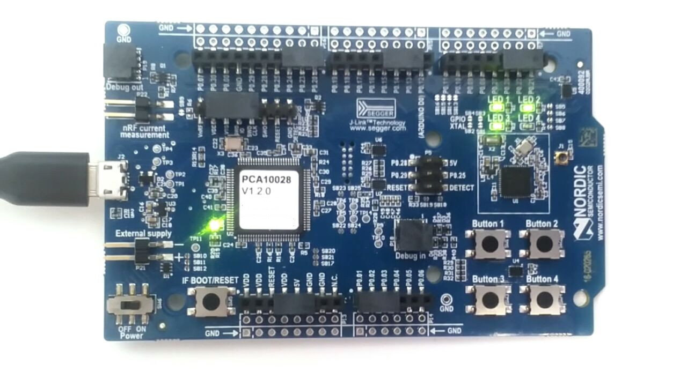

### BLE Examples

This repo has a small compilation of examples on how to use Nordic Semiconductor's
nRF51 DK (nRF51822) board with their SDK and SoftDevice BLE stack.

The examples show how to perform simple tasks as well as how to add new services
and characteristics and to make them writable, readable or notifying in a simple way.

In order to compile the examples, set the variable
**SDK_PATH := /home/user/path/to/nRF5_SDK_11** in the **Makefile** to the
corresponding path.

New files or libraries added need to be taken into account in the **Makefile** as
well, all the **\*.c** files should be added to the variable **C_SOURCE_FILES**
and the directories containing them or the **\*.h** files should be added to the
**INC_PATHS** variable as shown in the examples.

The code is compiled with **make** and compiled+uploaded with **make flash**.

In order to be able to use the BLE stack the SoftDevice must first be uploaded at
the beginning of the memory. To do so, save it at the same level as the SDK and
run the command **make flash_softdevice** before running **make flash** to upload
the application. This must only be done the first time, or if a program that didn't
use SoftDevice was flashed previously.

To use the LEDs 1 and 2 as a visual aid set the variable **BT_LED_ON** to 1 in
**ble/bleStartup/bleStartup.c** . This will turn on LED1 when the board is
advertising and then LED2 when a connection has been established. This however
takes up two LEDs, so keep the variable to 0 if they are needed.

In this same file are the methods used to set up the BLE connectivity.
It is divided in two, with the functions that need to be adjusted to the
changes in services or characteristics at the beginning. The lines that need to
be paid most attention are indicated with a **//<-------** .
